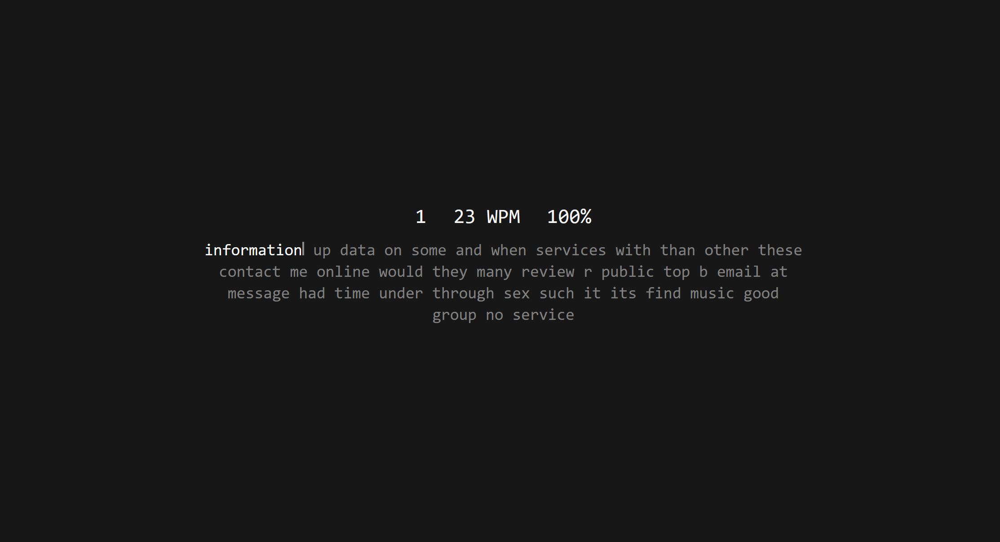
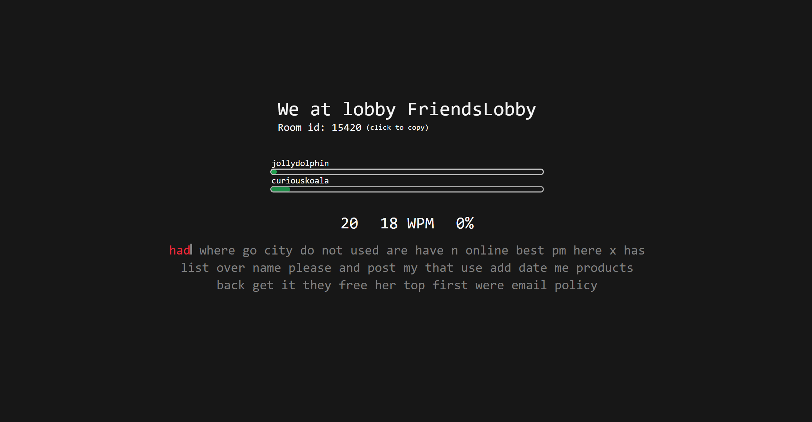

# PetaByte - Speed Typing

PetaByte is a web application that lets users test their typing speed and accuracy in a fun and competitive environment. It offers two exciting modes: Solo Mode for individual practice and Multi Mode for players to compete against each other. The app is built using Next.js, Supabase, Socket.io, and Redis to ensure a seamless and real-time experience for all users.

# Features

- Solo Mode: Practice typing with random texts and get instant feedback on your accuracy and words per minute (WPM).

- Multi Mode: Compete against other players in real-time and view each player's progress during the typing challenge.
- Leaderboard: Keep track of the top performers in the Multi Mode and strive to climb up the ranks.

- Diverse Texts: PetaByte offers a wide range of texts from various genres to keep the typing experience engaging and interesting.
- User Authentication: Users can create accounts and log in to save their progress and compare their statistics with others.

## Technologies Used

- Next.js: A React framework that enables server-side rendering, making the application fast and SEO-friendly.
- Supabase: An open-source Firebase alternative that provides authentication, database, and storage services.
- Socket.io: A library for real-time, bidirectional communication between the server and clients, essential for Multi Mode functionality.
- Redis: An in-memory data structure store used for caching and managing real-time data in Multi Mode.

## Installation and Setup

To run PetaByte on your local machine, follow these steps:

1. Clone the repository from GitHub:
   <code>
   git clone https://github.com/your-username/petabyte.git  
   cd petabyte
   </code>
1. Install dependencies:
   <code>
   npm install
   </code>
1. Configure Supabase:

   1. Create a Supabase project and obtain your API keys.
   1. Set up the necessary tables and columns for user data and typing challenge records.

1. Configure Redis:

   1. Install Redis on your machine.
   1. Update the Redis connection settings in the application.

1. Run the application:
   <code>
   npm run dev
   </code>
1. Open your browser and access the application at http://localhost:3000.

## Known Issues

- Synchronization issues in Multi Mode: Starting the game works fine most of the time. Restarting doesn't work most of the time.
- Text synchronization issues in Multi Mode: The text is not synchronized properly between players. If you allow the first match to finish (30sec) without pressing any key and start the next match to start, the text gets synchronized properly.

Enjoy testing your typing skills and having a great time competing with others.

Happy typing! 🚀
